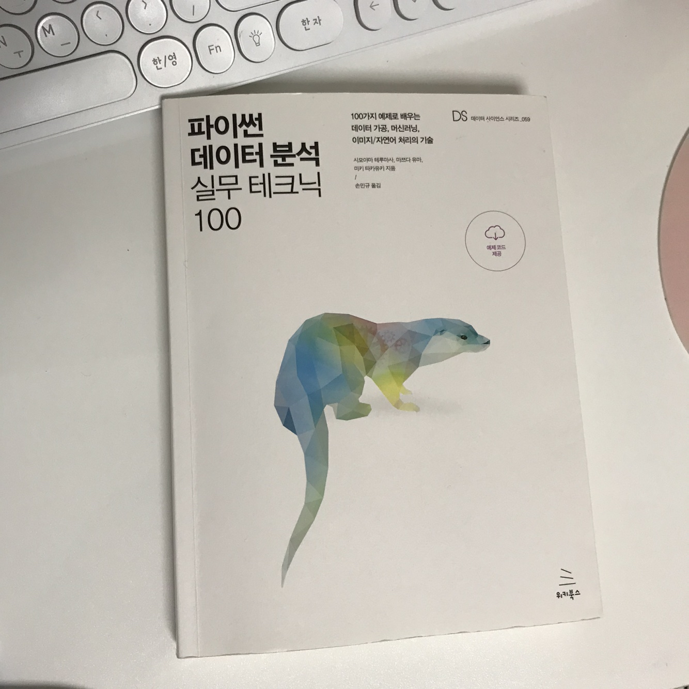

# Python_tech100
Summarize what I learned after studying the book, 『Python Data Analysis Practice Tech 100』.  
I highly recommend this book because I learned how to analyze Python data in practice!  
I wrote down the example code of Chapter 1 through 10 and what I studied in more depth, in the Jupyter Notebook.  
Also I recorded the contents and explanations that I studied more deeply in my blog, so if you're interesting about it, please check [this page](https://suy379.tistory.com/20?category=937254).  
Thanks :)  

제가 『파이썬 데이터 분석 실무 테크닉 100』을 공부하면서 배운 것들을 정리한 깃허브입니다.  
이 책을 통해 실무에서 사용하는 파이썬 데이터 분석을 어떻게 하는지를 배울 수 있어서, 매우 추천하는 책입니다!  
주피터 노트북에는 1장부터 10장까지의 예제 코드 및 설명을 적어두었으며, 예제 코드와 다르게 만든 코드와 더 심화해서 공부한 내용을 기록했습니다.  
더 심화해서 공부한 내용과 설명은 [저의 블로그](https://suy379.tistory.com/20?category=937254)에 기록하였으니 관심 있으시면 참고하세요! :)     

# Table of Contents
## Chapter 1 ~ 8
- It deals with practice-oriented data analysis.
- Data preprocessing, groupby, plotting, Machine Learning(Regression, Classification), Optimization, Simulation

## Chapter 9 ~ 10
- It deals with basic AI technologies that deal with image, text unstructured data.
- Chapter 9: image/video processing technology
- Chapter 10: Natural Language Processing(NLP)

